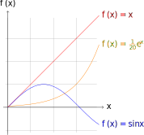
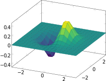
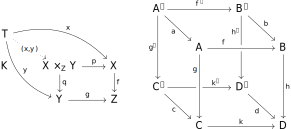

# Obsidian Latex Renderer

This plugin renders codeblocks with the label `latex` into an SVG and displays them inline in the note on preview. You are required to bring your own command that outputs a `.svg` file from a `.tex` file input, examples are given below.

# Setup
1. Install latex
2. Install this plugin
3. Set the command in settings

## Command Syntax
When these strings appear in your command, they will be replaced with their respective values. I would recommend wrapping them in quote marks `""` in the event of spaces.

`{tex-file}`: The relative path to the generated tex file with respect to the current working directory.

`{pdf-file}`: The absolute path to the generated pdf file.

`{output-dir}`: The absolute path to the current working directory.

## Examples
Note that these were tested on Windows only, I do not know if they work on other OSs.

### `pdflatex` and `pdf2svg2`
This is the first way I tried to generate latex to an `.svg`. The given command is set by default.

Install
- Miktex(this installs `pdflatex`): https://miktex.org/
- `pdf2svg2`: https://community.jalios.com/jcms/jc2_183627/en/pdf2svg2-bat-script

Set the command

    pdflatex -interaction=nonstopmode -halt-on-error -shell-escape "{tex-file}" && pdf2svg "{pdf-file}" "{output-dir}"

You may want to use the absolute paths to `pdflatex` and `pdf2svg`.

### `tectonic` and `pdf2svg2` (recommended)
Install
- `tectonic`: https://tectonic-typesetting.github.io/en-US/
- `pdf2svg2`: https://community.jalios.com/jcms/jc2_183627/en/pdf2svg2-bat-script

Set the command

    tectonic -X compile "{tex-file}" && pdf2svg2 "{pdf-file}" "{output-dir}"

# Usage
The content inside of `latex` code blocks will be rendered using the given command. The document class `standalone` will be set for you using `\documentclass{standalone}`. You can load any packages you need with `\usepackage{}`.

The generated svg's `<div>` parent has the class `block-language-latex`, so it can be styled using CSS snippets. For example, if you are using dark mode you can set `filter: invert(100%)` to invert the colours for a quick hack for dark themed diagrams. You could also set `background-color: white`.

## Caching
By default the plugin will keep generated `.svg` files in `.obsidian/obsidian-latex-render-svg-cache/` so it won't have to re-render if nothing in the code block has changed, or you copy the code block to a different file, the plugin will simply reuse the `.svg` file. It'll keep track of which files use each `.svg` and when no files use a `.svg` the plugin removes it from the cache.

This should allow (hasn't been tested) `latex` code blocks to appear as `.svg` in notes when the vault is synced across different devices that may not have `latex` installed. Just don't edit the code block otherwise it won't be happy.

## Examples
The svgs shown below have been generated in Obsidian with the setup in [`tectonic` and `pdf2svg2`](###-`tectonic`-and-`pdf2svg2`-(recommended))



````latex
```latex
\usepackage{tikz}
\begin{document}
  \begin{tikzpicture}[domain=0:4]
    \draw[very thin,color=gray] (-0.1,-1.1) grid (3.9,3.9);
    \draw[->] (-0.2,0) -- (4.2,0) node[right] {$x$};
    \draw[->] (0,-1.2) -- (0,4.2) node[above] {$f(x)$};
    \draw[color=red]    plot (\x,\x)             node[right] {$f(x) =x$};
    \draw[color=blue]   plot (\x,{sin(\x r)})    node[right] {$f(x) = \sin x$};
    \draw[color=orange] plot (\x,{0.05*exp(\x)}) node[right] {$f(x) = \frac{1}{20} \mathrm e^x$};
  \end{tikzpicture}
\end{document}
```
````


````latex
```latex
\usepackage{circuitikz}
\begin{document}
\begin{circuitikz}[american, voltage shift=0.5]
\draw (0,0)
to[isource, l=$I_0$, v=$V_0$] (0,3)
to[short, -*, i=$I_0$] (2,3)
to[R=$R_1$, i>_=$i_1$] (2,0) -- (0,0);
\draw (2,3) -- (4,3)
to[R=$R_2$, i>_=$i_2$]
(4,0) to[short, -*] (2,0);
\end{circuitikz}
\end{document}
```
````



````latex
```latex
\usepackage{pgfplots}
\pgfplotsset{compat=1.16}
\begin{document}
\begin{tikzpicture}
\begin{axis}[colormap/viridis]
\addplot3[
	surf,
	samples=18,
	domain=-3:3
]
{exp(-x^2-y^2)*x};
\end{axis}
\end{tikzpicture}
\end{document}
```
````



````latex
```latex
\usepackage{tikz-cd}
\begin{document}
\begin{tikzcd}
T
\arrow[drr, bend left, "x"]
\arrow[ddr, bend right, "y"]
\arrow[dr, dotted, "{(x,y)}" description] & & \\
K & X \times_Z Y \arrow[r, "p"] \arrow[d, "q"]
& X \arrow[d, "f"] \\
& Y \arrow[r, "g"]
& Z
\end{tikzcd}
\quad \quad
\begin{tikzcd}[row sep=2.5em]
A' \arrow[rr,"f'"] \arrow[dr,swap,"a"] \arrow[dd,swap,"g'"] &&
B' \arrow[dd,swap,"h'" near start] \arrow[dr,"b"] \\
& A \arrow[rr,crossing over,"f" near start] &&
B \arrow[dd,"h"] \\
C' \arrow[rr,"k'" near end] \arrow[dr,swap,"c"] && D' \arrow[dr,swap,"d"] \\
& C \arrow[rr,"k"] \arrow[uu,<-,crossing over,"g" near end]&& D
\end{tikzcd}
\end{document}
```
````


````latex
```latex
\usepackage{chemfig}
\begin{document}
\chemfig{[:-90]HN(-[::-45](-[::-45]R)=[::+45]O)>[::+45]*4(-(=O)-N*5(-(<:(=[::-60]O)-[::+60]OH)-(<[::+0])(<:[::-108])-S>)--)}
\end{document}
```
````


````latex
```latex
\usepackage{chemfig}
\begin{document}
\definesubmol\fragment1{
(-[:#1,0.85,,,draw=none]
-[::126]-[::-54](=_#(2pt,2pt)[::180])
-[::-70](-[::-56.2,1.07]=^#(2pt,2pt)[::180,1.07])
-[::110,0.6](-[::-148,0.60](=^[::180,0.35])-[::-18,1.1])
-[::50,1.1](-[::18,0.60]=_[::180,0.35])
-[::50,0.6]
-[::110])
}
\chemfig{
!\fragment{18}
!\fragment{90}
!\fragment{162}
!\fragment{234}
!\fragment{306}
}
\end{document}
```
````

# TODO
- Use `tectonic`'s html experimental output, removing the need for `pdf2svg`
- Find a better name (it feels generic, i don't like it)
- Add preamable's
- Github actions release
- Use https://quicklatex.com/ as a renderer